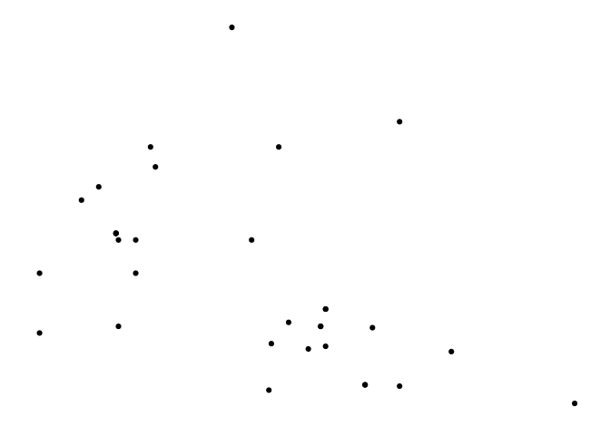
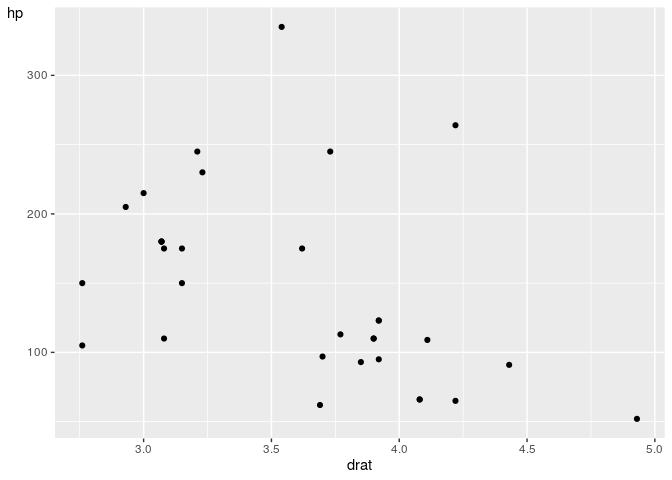

<!-- README.md is generated from README.Rmd. Please edit that file -->

# relper

The goal of relper is to provide miscellaneous functions to assist in
data cleaning and visualization.

## Installation

You can install the developer version of relper with:

``` r
remotes::install_github("vbfelix/relper")
```

## ggplot2 functions

``` r
library(ggplot2)

plot <- 
ggplot(mtcars,aes(drat,hp))+
  geom_point()

plot
```


### theme\_x

``` r
plot + theme_x()
```


### theme\_y

``` r
plot + theme_y()
```


### theme\_map

``` r
plot + theme_map()
```


### flip\_y\_title

``` r
plot + flip_y_title
```



### water\_mark

``` r
url <- "https://upload.wikimedia.org/wikipedia/commons/thumb/1/1b/R_logo.svg/1200px-R_logo.svg.png"

logo <- water_mark(url, local_file = F)

plot + annotation_custom(logo)
```



## Metrics

``` r
x <- rexp(20,.5)

x
#>  [1] 1.1648435 1.1287297 2.2085722 1.1166282 0.1521227 0.4931802 1.1548049
#>  [8] 1.5323907 0.2704114 1.1844414 1.0040010 0.1656004 1.4771211 0.5574183
#> [15] 1.5271919 6.1837545 1.3643848 0.6574451 2.0666065 1.9663614
```

### Coefficient of Variation (CV)

``` r
#raw
cv(x, perc = F)
#> [1] 0.9367495

#%
cv(x, perc = T)
#> [1] 93.67495
```

### Mean’s

``` r
num_mean(x)
#> # A tibble: 1 x 3
#>   arithmetic geometric harmonic
#>        <dbl>     <dbl>    <dbl>
#> 1       1.37     0.979    0.638
```

#### Harmonic mean

``` r
harmonic_mean(x)
#> [1] 0.6384985
```

### Numeric univariate summary statistics

``` r
num_summary(x)
#> # A tibble: 1 x 12
#>       n    na negative equal_zero positive   min   p25   p50   p75   max  mean
#>   <int> <int>    <int>      <int>    <int> <dbl> <dbl> <dbl> <dbl> <dbl> <dbl>
#> 1    20     0        0          0       20 0.152 0.632  1.16  1.53  6.18  1.37
#> # … with 1 more variable: cv <dbl>
```

### Correlations

``` r
y <- rnorm(20)

num_corr(x,y)
#> # A tibble: 1 x 3
#>   pearson kendall spearman
#>     <dbl>   <dbl>    <dbl>
#> 1  0.0340 -0.0842   -0.125
```

## Others

### Area under the curve

``` r
x <- seq(-3,3,l = 100)

y <- dnorm(x)

plot(x,y)
```


``` r
auc(x,y)
#> [1] 0.9972835
```
