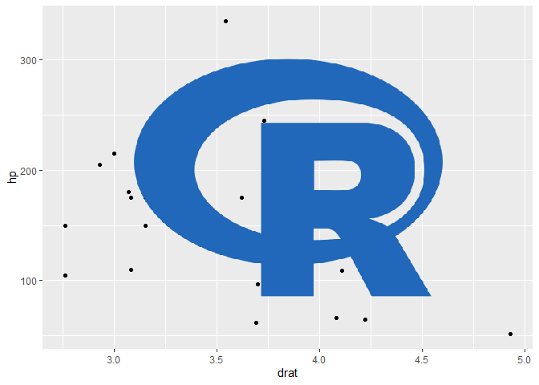
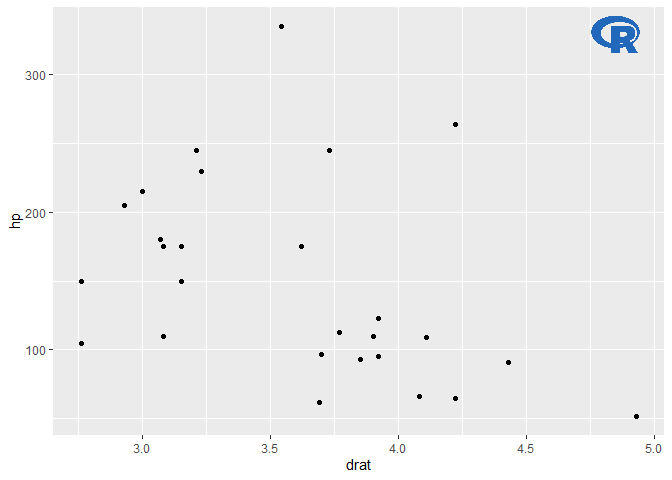
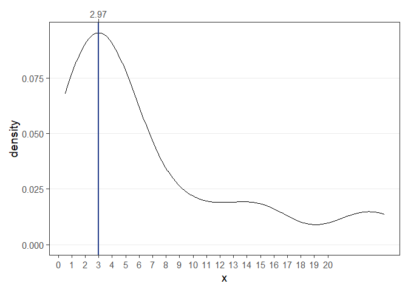
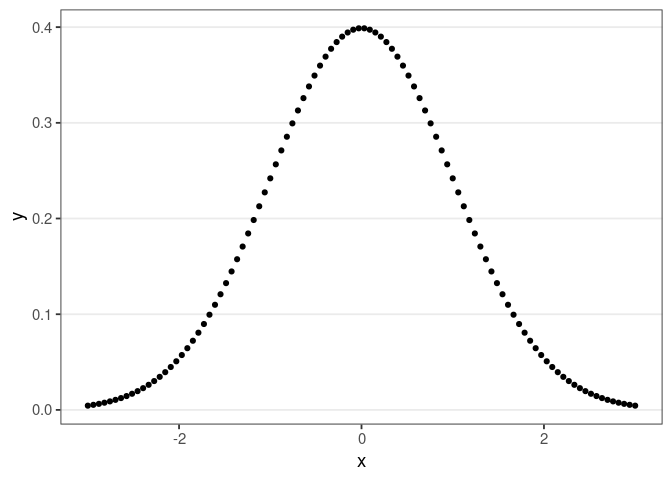
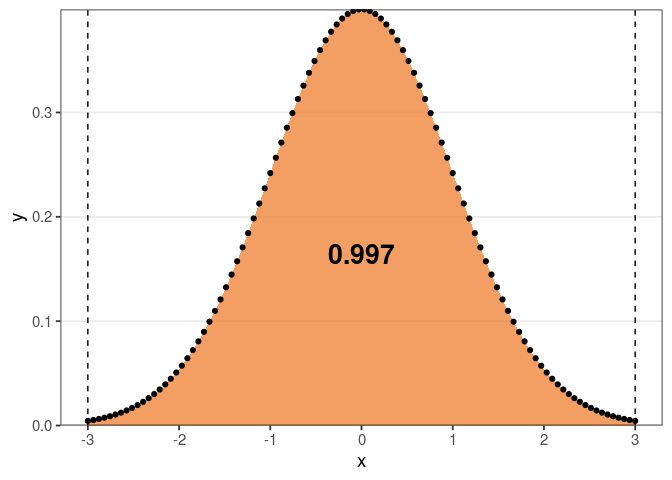
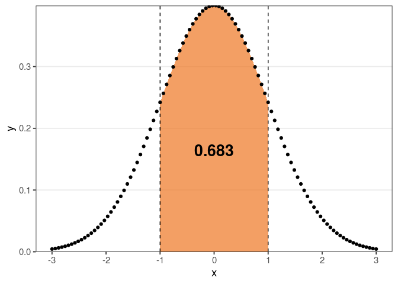

-   [relper](#relper)
    -   [Installation](#installation)
    -   [Date Manipulation](#date-manipulation)
        -   [Create date auxiliary
            variables](#create-date-auxiliary-variables)
        -   [Date difference](#date-difference)
    -   [ggplot2 functions](#ggplot2-functions)
        -   [theme\_x](#theme_x)
        -   [theme\_y](#theme_y)
        -   [theme\_xy](#theme_xy)
        -   [theme\_map](#theme_map)
        -   [flip\_y\_title](#flip_y_title)
        -   [water\_mark](#water_mark)
        -   [calendar data and plot (from
            ggcal)](#calendar-data-and-plot-from-ggcal)
    -   [Metrics](#metrics)
        -   [Highest density value](#highest-density-value)
        -   [Mode](#mode)
        -   [Coefficient of
            Variation (CV)](#coefficient-of-variation-cv)
        -   [Mean’s](#means)
        -   [Numeric univariate summary
            statistics](#numeric-univariate-summary-statistics)
        -   [Correlations](#correlations)
    -   [Scaling](#scaling)
        -   [Linear scaling from a to b](#linear-scaling-from-a-to-b)
        -   [Scaling to percentage](#scaling-to-percentage)
    -   [Others](#others)
        -   [Area under the curve](#area-under-the-curve)

<!-- README.md is generated from README.Rmd. Please edit that file -->

# relper

The goal of relper is to provide miscellaneous functions to assist in
data cleaning and visualization.

## Installation

You can install the developer version of relper with:

``` r
remotes::install_github("vbfelix/relper")
```

## Date Manipulation

### Create date auxiliary variables

``` r
df_date
#> # A tibble: 6 x 1
#>   date      
#>   <date>    
#> 1 2021-09-27
#> 2 2021-09-28
#> 3 2021-09-29
#> 4 2021-09-30
#> 5 2021-10-01
#> 6 2021-10-02
```

``` r
df_date %>% 
  date_vars(date) %>% 
  glimpse()
#> Rows: 6
#> Columns: 10
#> $ date    <date> 2021-09-27, 2021-09-28, 2021-09-29, 2021-09-30, 2021-10-01, 2~
#> $ mes_abb <ord> set, set, set, set, out, out
#> $ mes_lbl <ord> setembro, setembro, setembro, setembro, outubro, outubro
#> $ mes_num <dbl> 9, 9, 9, 9, 10, 10
#> $ dia_num <int> 27, 28, 29, 30, 1, 2
#> $ ano_num <dbl> 2021, 2021, 2021, 2021, 2021, 2021
#> $ ano_lbl <fct> 2021, 2021, 2021, 2021, 2021, 2021
#> $ sem_num <dbl> 39, 39, 39, 39, 39, 39
#> $ dia_sem <ord> seg, ter, qua, qui, sex, sáb
#> $ dia_lbl <chr> "27 [seg]", "28 [ter]", "29 [qua]", "30 [qui]", "1 [sex]", "2 ~
```

### Date difference

``` r
date1 <- dmy("01/05/1998")
date2 <- dmy("21/11/2018")

diff_date(first_date = date1,last_date = date2,units = "days")
#> [1] 7509
```

## ggplot2 functions

``` r
library(ggplot2)

plot <- 
ggplot(mtcars,aes(drat,hp))+
  geom_point()

plot
```


### theme\_x

``` r
plot + theme_x()
```


### theme\_y

``` r
plot + theme_y()
```


### theme\_xy

``` r
plot + theme_xy()
```


### theme\_map

``` r
plot + theme_map()
```


### flip\_y\_title

``` r
plot + flip_y_title
```


### water\_mark

``` r
url <- "https://istatistikcibiri.files.wordpress.com/2020/03/285_r_project_logo-512.png"

logo <- water_mark(url, local_file = F)

plot + annotation_custom(logo)
```



``` r
plot + annotation_custom(logo, xmin = 4.65, xmax = Inf, ymin = 310, ymax = Inf)
```



### calendar data and plot (from ggcal)

``` r
library(tidyverse)

date <- seq(as.Date("2016-01-01"), as.Date("2016-02-29"),by = "1 day")

#data
df <-
  tibble(dates = rep(date, 3),
         value = num_format(rnorm(3*length(date)),0),
         grp = rep(c("A","B","C"), each = length(date))) %>%
  nest(-grp) %>%
  mutate(aux = map(data,~cal_data(.$dates,.$value))) %>%
  select(-data) %>%
  unnest() 

head(df)
#> # A tibble: 6 x 9
#>   grp   date       fill      x month    year monlabel     y wday 
#>   <chr> <date>     <chr> <dbl> <ord>   <dbl> <fct>    <dbl> <ord>
#> 1 A     2016-01-01 -1        5 janeiro  2016 Janeiro     10 Sex  
#> 2 A     2016-01-02 0         6 janeiro  2016 Janeiro     10 Sáb  
#> 3 A     2016-01-03 -1        0 janeiro  2016 Janeiro      9 Dom  
#> 4 A     2016-01-04 0         1 janeiro  2016 Janeiro      9 Seg  
#> 5 A     2016-01-05 1         2 janeiro  2016 Janeiro      9 Ter  
#> 6 A     2016-01-06 1         3 janeiro  2016 Janeiro      9 Qua

df %>% 
  cal_plot(facet = grp)+
  scale_fill_viridis_d()
```


<!-- ### Duas axis plot -->
<!-- ```{r} -->
<!-- x <- seq(0,1,l = 100) -->
<!-- y <- cumsum(rnorm(100)) -->
<!-- z <- y^3 + rnorm(100) -->
<!-- df <- data.frame(x,y,z) -->
<!-- dual_plot(df,x_axis = "x",y_left = "y",y_right = "z") -->
<!-- ``` -->

## Metrics

``` r
x <- rexp(20,.2)

x
#>  [1]  1.707552 22.068168  4.233392  2.678935  1.423747  3.843652  8.529778
#>  [8]  0.509693  1.142447 24.166094  5.010347  1.270007 14.543939  2.852893
#> [15]  4.483005  3.524638  5.827093 10.900723 15.381404  3.034683
```

### Highest density value

``` r
num_mode(x)
#> [1] 2.968253
```



### Mode

``` r
let <- sample(letters,100,replace = TRUE)

table(let)
#> let
#> a b c d e f g h i j k l m n o p r s t u v w x y z 
#> 3 2 4 5 2 2 3 4 5 2 7 8 8 3 4 2 2 2 3 3 4 5 8 6 3
```

``` r
cat_mode(let)
#> [1] "m"
```

### Coefficient of Variation (CV)

``` r
#raw
cv(x, perc = F)
#> [1] 1.02

#%
cv(x, perc = T)
#> [1] 101.89
```

### Mean’s

``` r
num_mean(x)
#> # A tibble: 1 x 3
#>   arithmetic geometric harmonic
#>        <dbl>     <dbl>    <dbl>
#> 1       6.86      4.24     2.57
```

#### Harmonic mean

``` r
harmonic_mean(x)
#> [1] 2.574064
```

#### Geometric mean

``` r
geometric_mean(x)
#> [1] 4.236722
```

### Numeric univariate summary statistics

``` r
num_summary(x)
#> # A tibble: 1 x 13
#>       n    na negative equal_zero positive   min   p25   p50   p75   max  mode
#>   <int> <int>    <int>      <int>    <int> <dbl> <dbl> <dbl> <dbl> <dbl> <dbl>
#> 1    20     0        0          0       20 0.510  2.44  4.04  9.12  24.2  2.97
#> # ... with 2 more variables: mean <dbl>, cv <dbl>
```

### Correlations

``` r
y <- rnorm(20)

num_corr(x,y)
#> # A tibble: 1 x 3
#>   pearson kendall spearman
#>     <dbl>   <dbl>    <dbl>
#> 1 -0.0178  0.0526  -0.0165
```

## Scaling

### Linear scaling from a to b

``` r
x <- seq(-3,3,l = 10)

x
#>  [1] -3.0000000 -2.3333333 -1.6666667 -1.0000000 -0.3333333  0.3333333
#>  [7]  1.0000000  1.6666667  2.3333333  3.0000000

y <- scale01(x)

y
#>  [1] 0.0000000 0.1111111 0.2222222 0.3333333 0.4444444 0.5555556 0.6666667
#>  [8] 0.7777778 0.8888889 1.0000000
```



``` r
z <- scale01(x,lim_sup = 100)
```



### Scaling to percentage

#### Multiply by 100

``` r
mtcars %>% 
  count(vs,am) %>% 
  mutate(prop = n/sum(n)) %>% 
  mutate(perc = as_perc(prop))
#>   vs am  n    prop   perc
#> 1  0  0 12 0.37500 37.500
#> 2  0  1  6 0.18750 18.750
#> 3  1  0  7 0.21875 21.875
#> 4  1  1  7 0.21875 21.875
```

#### Divide by total and multiply by 100

``` r
mtcars %>% 
  count(vs,am) %>% 
  mutate(perc = as_perc(n,sum = T))
#>   vs am  n   perc
#> 1  0  0 12 37.500
#> 2  0  1  6 18.750
#> 3  1  0  7 21.875
#> 4  1  1  7 21.875
```

## Others

### Area under the curve

``` r
x <- seq(-3,3,l = 100)

y <- dnorm(x)
```



``` r
#from min to max of x
range(x)
#> [1] -3  3

auc(x,y)
#> [1] 0.9972835
```


``` r
#from -2 to 2
auc(x,y,limits = c(-2,2))
#> [1] 0.9544345
```


``` r
#from -1 to 1
auc(x,y,limits = c(-1,1))
#> [1] 0.6825416
```


