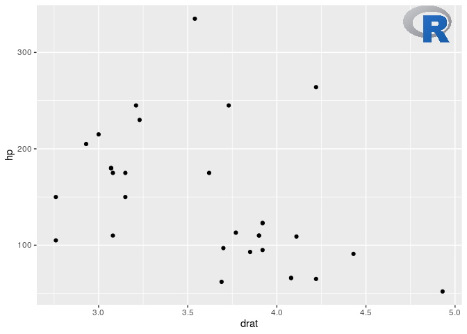
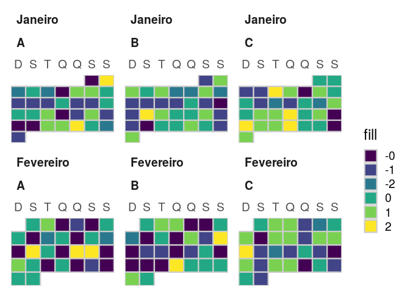

<!-- README.md is generated from README.Rmd. Please edit that file -->

# relper

The goal of relper is to provide miscellaneous functions to assist in
data cleaning and visualization.

## Installation

You can install the developer version of relper with:

``` r
remotes::install_github("vbfelix/relper")
```

## ggplot2 functions

``` r
library(ggplot2)

plot <- 
ggplot(mtcars,aes(drat,hp))+
  geom_point()

plot
```


### theme\_x

``` r
plot + theme_x()
```


### theme\_y

``` r
plot + theme_y()
```


### theme\_map

``` r
plot + theme_map()
```


### flip\_y\_title

``` r
plot + flip_y_title
```


### water\_mark

``` r
url <- "https://upload.wikimedia.org/wikipedia/commons/thumb/1/1b/R_logo.svg/1200px-R_logo.svg.png"

logo <- water_mark(url, local_file = F)

plot + annotation_custom(logo)
```


``` r

plot + annotation_custom(logo, xmin = 4.75, xmax = 5, ymin = 315, ymax = 335)
```



### calendar data and plot (from ggcal)

``` r
library(tidyverse)

date <- seq(as.Date("2016-01-01"), as.Date("2016-02-29"),by = "1 day")

#data
df <-
  tibble(dates = rep(date, 3),
         value = num_format(rnorm(3*length(date)),0),
         grp = rep(c("A","B","C"), each = length(date))) %>%
  nest(-grp) %>%
  mutate(aux = map(data,~cal_data(.$dates,.$value))) %>%
  select(-data) %>%
  unnest() 

head(df)
#> # A tibble: 6 x 9
#>   grp   date       fill      x month    year monlabel     y wday 
#>   <chr> <date>     <chr> <dbl> <ord>   <dbl> <fct>    <dbl> <ord>
#> 1 A     2016-01-01 2         5 janeiro  2016 Janeiro     10 Sex  
#> 2 A     2016-01-02 -0        6 janeiro  2016 Janeiro     10 Sáb  
#> 3 A     2016-01-03 0         0 janeiro  2016 Janeiro      9 Dom  
#> 4 A     2016-01-04 1         1 janeiro  2016 Janeiro      9 Seg  
#> 5 A     2016-01-05 0         2 janeiro  2016 Janeiro      9 Ter  
#> 6 A     2016-01-06 -0        3 janeiro  2016 Janeiro      9 Qua

df %>% 
  cal_plot(facet = grp)+
  scale_fill_viridis_d()
```



## Metrics

``` r
x <- rexp(20,.5)

x
#>  [1] 1.89599263 4.50506953 1.71776172 1.94380798 0.01750844 1.88013313
#>  [7] 5.03444907 0.30076595 1.53995196 1.13018828 2.62573258 3.14514321
#> [13] 0.24465338 1.07007163 2.86454990 0.77972041 0.99306952 6.71351822
#> [19] 2.98408302 1.05080126
```

### Coefficient of Variation (CV)

``` r
#raw
cv(x, perc = F)
#> [1] 0.8095792

#%
cv(x, perc = T)
#> [1] 80.95792
```

### Mean’s

``` r
num_mean(x)
#> # A tibble: 1 x 3
#>   arithmetic geometric harmonic
#>        <dbl>     <dbl>    <dbl>
#> 1       2.12      1.32    0.269
```

#### Harmonic mean

``` r
harmonic_mean(x)
#> [1] 0.2690128
```

#### Geometric mean

``` r
geometric_mean(x)
#> [1] 1.317884
```

### Numeric univariate summary statistics

``` r
num_summary(x)
#> # A tibble: 1 x 13
#>       n    na outlier negative equal_zero positive    min   p25   p50   p75
#>   <int> <int>   <int>    <int>      <int>    <int>  <dbl> <dbl> <dbl> <dbl>
#> 1    20     0       1        0          0       20 0.0175  1.04  1.80  2.89
#> # … with 3 more variables: max <dbl>, mean <dbl>, cv <dbl>
```

### Correlations

``` r
y <- rnorm(20)

num_corr(x,y)
#> # A tibble: 1 x 3
#>   pearson kendall spearman
#>     <dbl>   <dbl>    <dbl>
#> 1  -0.448    -0.4   -0.579
```

## Others

### Area under the curve

``` r
x <- seq(-3,3,l = 100)

y <- dnorm(x)

plot(x,y)
```


``` r
#from min to max of x
range(x)
#> [1] -3  3

auc(x,y)
#> [1] 0.9972835

#from -2 to 2
auc(x,y,limits = c(-2,2))
#> [1] 0.9544345

#from -1 to 1
auc(x,y,limits = c(-1,1))
#> [1] 0.6825416
```
