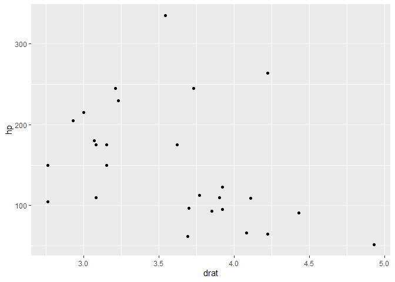

<!-- README.md is generated from README.Rmd. Please edit that file -->

# relper

The goal of relper is to provide miscellaneous functions to assist in
data cleaning and preparation

## Installation

You can install the developer version of relper from
[CRAN](https://CRAN.R-project.org) with:

``` r
remotes::install_github("vbfelix/relper")
```

## ggplot2 functions

This is a basic example which shows you how to solve a common problem:

``` r
library(ggplot2)
plot <- 
ggplot(mtcars,aes(drat,hp))+
  geom_point()

plot
```



### theme\_x

``` r
plot + theme_x()
```


### theme\_y

``` r
plot + theme_y()
```


### theme\_x

``` r
plot + theme_map()
```


## metrics

``` r

x <- rexp(100,.5)

x
#>   [1]  0.17697237  2.47488510  1.93699936  1.39829643  1.45665281  0.13010846
#>   [7]  0.47167049  1.63154312  2.57147700  0.42753692  0.81348992  0.32636099
#>  [13]  0.10507934  1.21176633  1.59094878  0.01412007  7.30162219  2.31215199
#>  [19]  1.02485282  0.69117810  1.34262960 11.61860487  0.08293280  1.08520163
#>  [25]  0.19801143  0.29674719  2.47288456  0.22576728  1.61997221  2.11718274
#>  [31]  6.40370092  2.54267953  0.65473233  0.81085271  0.78048909  0.79662703
#>  [37]  1.59231423  3.87653069  0.77864180  2.88775673  0.50433293  2.64729946
#>  [43]  2.11179676  0.31293982  1.68329680  0.07726836  6.02816011  0.86124813
#>  [49]  0.12520528  1.95501085  5.26507189  1.43410125  6.49514139  3.41268220
#>  [55]  0.56102530  2.82208128  3.32188728  1.72902265  0.44402642  0.02256761
#>  [61]  0.54645452  6.62145771  0.54413133  0.72190270  1.41309678  2.02927946
#>  [67]  0.56802934  2.18784984  1.63303846  0.59246630  1.50672255  6.43642949
#>  [73]  0.51349579  3.42219750  5.34300077  0.48016959  3.64050506  2.24255338
#>  [79]  0.91755939  0.16504119  0.16218632  0.10877679  0.14271618  0.09867367
#>  [85]  7.28669937  1.18125156  0.15961605  0.27304405  3.56565890  0.60939631
#>  [91]  2.04492330  1.36963317 13.99518814  0.02869721  6.18124016  1.52251168
#>  [97]  0.14411086  0.94434586  0.11671033  0.17620194
```

### Coefficient of Variation (CV)

``` r

#raw
cv(x, perc = F)
#> [1] 1.24609

#%
cv(x, perc = T)
#> [1] 124.609
```

### Harmonic mean

``` r

harmonic_mean(x)
#> [1] 0.2811607
```

## Other

### Area under the curve

``` r
x <- seq(-3,3,l = 100)
y <- dnorm(x)
plot(x,y)
```


``` r
auc(x,y)
#> [1] 0.9972835
```
