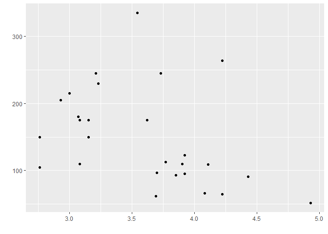
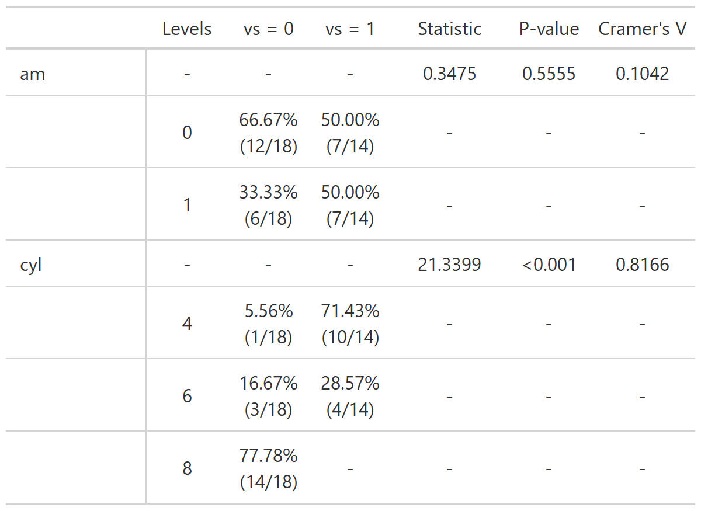

- <a href="#intro" id="toc-intro">Intro</a>
- <a href="#installation" id="toc-installation">Installation</a>
- <a href="#functions" id="toc-functions">Functions</a>
  - <a href="#as-functions" id="toc-as-functions">“As” functions</a>
    - <a href="#as_num" id="toc-as_num">as_num</a>
    - <a href="#as_perc" id="toc-as_perc">as_perc</a>
  - <a href="#calc-functions" id="toc-calc-functions">“Calc” functions</a>
    - <a href="#calc_acf" id="toc-calc_acf">calc_acf</a>
    - <a href="#calc_auc" id="toc-calc_auc">calc_auc</a>
    - <a href="#calc_corr" id="toc-calc_corr">calc_corr</a>
    - <a href="#calc_cramers_v" id="toc-calc_cramers_v">calc_cramers_v</a>
    - <a href="#calc_cv" id="toc-calc_cv">calc_cv</a>
    - <a href="#calc_date_aux" id="toc-calc_date_aux">calc_date_aux</a>
    - <a href="#calc_date_diff" id="toc-calc_date_diff">calc_date_diff</a>
    - <a href="#calc_date_range" id="toc-calc_date_range">calc_date_range</a>
    - <a href="#calc_geometric_mean"
      id="toc-calc_geometric_mean">calc_geometric_mean</a>
    - <a href="#calc_harmonic_mean"
      id="toc-calc_harmonic_mean">calc_harmonic_mean</a>
    - <a href="#calc_mean" id="toc-calc_mean">calc_mean</a>
    - <a href="#calc_mode" id="toc-calc_mode">calc_mode</a>
    - <a href="#calc_peak_density"
      id="toc-calc_peak_density">calc_peak_density</a>
  - <a href="#format-functions" id="toc-format-functions">“Format”
    functions</a>
    - <a href="#format_digit" id="toc-format_digit">format_digit</a>
    - <a href="#format_num" id="toc-format_num">format_num</a>
    - <a href="#format_scale" id="toc-format_scale">format_scale</a>
  - <a href="#not-functions" id="toc-not-functions">“Not” functions</a>
    - <a href="#not_in" id="toc-not_in">not_in</a>
    - <a href="#not_na" id="toc-not_na">not_na</a>
  - <a href="#plt-functions" id="toc-plt-functions">“Plt” functions</a>
    - <a href="#plt_flip_y_title"
      id="toc-plt_flip_y_title">plt_flip_y_title</a>
    - <a href="#plt_no_background"
      id="toc-plt_no_background">plt_no_background</a>
    - <a href="#plt_no_labels" id="toc-plt_no_labels">plt_no_labels</a>
    - <a href="#plt_scale_auto" id="toc-plt_scale_auto">plt_scale_auto</a>
    - <a href="#plt_theme_map" id="toc-plt_theme_map">plt_theme_map</a>
    - <a href="#plt_theme_x" id="toc-plt_theme_x">plt_theme_x</a>
    - <a href="#plt_theme_xy" id="toc-plt_theme_xy">plt_theme_xy</a>
    - <a href="#plt_theme_y" id="toc-plt_theme_y">plt_theme_y</a>
  - <a href="#str-functions" id="toc-str-functions">“Str” functions</a>
    - <a href="#str_clean" id="toc-str_clean">str_clean</a>
    - <a href="#str_select" id="toc-str_select">str_select</a>
    - <a href="#str_to_text" id="toc-str_to_text">str_to_text</a>
  - <a href="#summary-functions" id="toc-summary-functions">“Summary”
    functions</a>
    - <a href="#summary_cat" id="toc-summary_cat">summary_cat</a>
    - <a href="#summary_data" id="toc-summary_data">summary_data</a>
    - <a href="#summary_num" id="toc-summary_num">summary_num</a>
  - <a href="#tbl-functions" id="toc-tbl-functions">“Tbl” functions</a>
    - <a href="#tbl_chi_square" id="toc-tbl_chi_square">tbl_chi_square</a>
    - <a href="#tbl_format_num" id="toc-tbl_format_num">tbl_format_num</a>
    - <a href="#tbl_print" id="toc-tbl_print">tbl_print</a>
  - <a href="#other-functions" id="toc-other-functions">Other functions</a>
    - <a href="#cut_by_quantile" id="toc-cut_by_quantile">cut_by_quantile</a>
    - <a href="#expand_grid_unique"
      id="toc-expand_grid_unique">expand_grid_unique</a>
    - <a href="#is_outlier" id="toc-is_outlier">is_outlier</a>
    - <a href="#obj_to_string" id="toc-obj_to_string">obj_to_string</a>
    - <a href="#parse_text" id="toc-parse_text">parse_text</a>
    - <a href="#rpearson" id="toc-rpearson">rpearson</a>

<!-- README.md is generated from README.Rmd. Please edit that file -->

# Intro

The goal of relper is to provide miscellaneous functions to assist in
data cleaning and visualization.

# Installation

You can install the developer version of relper with:

``` r
remotes::install_github("vbfelix/relper")
```

# Functions

## “As” functions

### as_num

The goal of *as_num* is to be a version of as.numeric, where the input
is data with marks, such as “10.000,02”

``` r
as_num("123.456,78")
#> [1] 123456.8
```

### as_perc

The goal of *as_perc* is to compute a number as percentage. By default
the function will just multiply values by 100.

``` r
mtcars %>% 
  count(vs,am) %>% 
  mutate(prop = n/sum(n)) %>% 
  mutate(perc = as_perc(prop))
#>   vs am  n    prop   perc
#> 1  0  0 12 0.37500 37.500
#> 2  0  1  6 0.18750 18.750
#> 3  1  0  7 0.21875 21.875
#> 4  1  1  7 0.21875 21.875
```

If you set the parameter *sum* to `TRUE` will divide the values by total
and multiply by 100.

``` r
mtcars %>% 
  count(vs,am) %>% 
  mutate(perc = as_perc(n,sum = TRUE))
#>   vs am  n   perc
#> 1  0  0 12 37.500
#> 2  0  1  6 18.750
#> 3  1  0  7 21.875
#> 4  1  1  7 21.875
```

## “Calc” functions

This functions will compute a certain value.

### calc_acf

The goal of *calc_acf* is to computes the auto-correlation.

``` r
x <- rnorm(100)

calc_acf(x)
#> # A tibble: 21 x 2
#>         acf   lag
#>       <dbl> <dbl>
#>  1  1           0
#>  2  0.159       1
#>  3 -0.0818      2
#>  4 -0.163       3
#>  5 -0.162       4
#>  6 -0.00682     5
#>  7 -0.0441      6
#>  8 -0.0992      7
#>  9  0.0595      8
#> 10  0.117       9
#> # ... with 11 more rows
```

If you pass a second vector the cross-correlation will be computed.

``` r
y <- rexp(100)

calc_acf(x,y)
#> # A tibble: 33 x 2
#>         ccf   lag
#>       <dbl> <dbl>
#>  1  0.00782   -16
#>  2  0.133     -15
#>  3 -0.0314    -14
#>  4 -0.122     -13
#>  5 -0.233     -12
#>  6 -0.103     -11
#>  7 -0.0513    -10
#>  8 -0.0112     -9
#>  9  0.0629     -8
#> 10  0.0210     -7
#> # ... with 23 more rows
```

### calc_auc

The goal of *calc_auc* is to compute the area under a curve (AUC).

``` r
x <- seq(-3,3,l = 100)

y <- dnorm(x)
```


``` r
#from min to max of x
range(x)
#> [1] -3  3

calc_auc(x,y)
#> [1] 0.9972835
```


``` r
#from -2 to 2
calc_auc(x,y,limits = c(-2,2))
#> [1] 0.9544345
```


``` r
#from -1 to 1
calc_auc(x,y,limits = c(-1,1))
#> [1] 0.6825416
```


### calc_corr

The goal of *calc_corr* is to compute Pearson, Kendall and Spearman
correlation coefficients.

``` r
x <- rnorm(100)

y <- rnorm(100)

calc_corr(x,y)
#> # A tibble: 1 x 3
#>   pearson kendall spearman
#>     <dbl>   <dbl>    <dbl>
#> 1   0.188   0.152    0.225
```

### calc_cramers_v

The goal of *calc_cramers_v* is to compute Cramer’s V.

``` r
m <- matrix(c(12, 5, 7, 7), ncol = 2)

chi_square <- chisq.test(m)

calc_cramers_v(chi_square)
#> [1] 0.1438099
```

### calc_cv

The goal of *calc_cv* is to compute the coefficient of variation (CV).

``` r
x <- rnorm(100,1)

calc_cv(x)
#> [1] 110.95
```

If you set the parameter `as_perc` to `FALSE`, the CV will not be
multiplied by 100.

``` r
x <- rnorm(100,1)

calc_cv(x,as_perc = FALSE)
#> [1] 0.9
```

### calc_date_aux

The goal of *calc_date_aux* is to compute variables derived from date,
such as year, month, day, etc.

``` r
dt <- seq(as.Date("1910/1/1"), as.Date("1911/1/1"), "days")

df_dt <- data.frame(dt = dt)

calc_date_aux(df_dt,dt) %>% glimpse()
#> Rows: 366
#> Columns: 10
#> $ dt       <date> 1910-01-01, 1910-01-02, 1910-01-03, 1910-01-04, 1910-01-05, ~
#> $ mon_abb  <ord> jan, jan, jan, jan, jan, jan, jan, jan, jan, jan, jan, jan, j~
#> $ mon_lbl  <ord> janeiro, janeiro, janeiro, janeiro, janeiro, janeiro, janeiro~
#> $ mon_num  <dbl> 1, 1, 1, 1, 1, 1, 1, 1, 1, 1, 1, 1, 1, 1, 1, 1, 1, 1, 1, 1, 1~
#> $ day_num  <int> 1, 2, 3, 4, 5, 6, 7, 8, 9, 10, 11, 12, 13, 14, 15, 16, 17, 18~
#> $ year_num <dbl> 1910, 1910, 1910, 1910, 1910, 1910, 1910, 1910, 1910, 1910, 1~
#> $ year_lbl <fct> 1910, 1910, 1910, 1910, 1910, 1910, 1910, 1910, 1910, 1910, 1~
#> $ week_num <dbl> 52, 52, 1, 1, 1, 1, 1, 1, 1, 2, 2, 2, 2, 2, 2, 2, 3, 3, 3, 3,~
#> $ day_week <ord> sáb, dom, seg, ter, qua, qui, sex, sáb, dom, seg, ter, qua, q~
#> $ week_day <chr> "1 [sáb]", "2 [dom]", "3 [seg]", "4 [ter]", "5 [qua]", "6 [qu~
```

### calc_date_diff

The goal of *calc_date_diff* is to compute the difference between two
dates.

``` r
date1 <- lubridate::dmy("01/05/1998")

date2 <- lubridate::dmy("21/11/2018")

calc_date_diff(date1 = date1,date2 = date2,unit = "days")
#> [1] 7509
```

If you need to add a constant to your difference you can use the
parameter `add`.

``` r
calc_date_diff(date1 = date1,date2 = date2,unit = "days",add = 1)
#> [1] 7510
```

### calc_date_range

The goal of *calc_date_range* is to compute the range of a date vector.

``` r
dt <- seq(as.Date("1910/1/1"), as.Date("1911/1/1"), "days")

calc_date_range(dt)
#> [1] "01/01/1910 - 01/01/1911"
```

### calc_geometric_mean

The goal of *calc_geometric_mean* is to compute the geometric mean.

``` r
calc_geometric_mean(x)
#> [1] 0.9085499
```

### calc_harmonic_mean

The goal of *calc_harmonic_mean* is to compute the harmonic mean.

``` r
calc_harmonic_mean(x)
#> [1] -0.0004410016
```

### calc_mean

The goal of *calc_mean* is to compute the arithmetic, geometric and
harmonic mean.

``` r
calc_mean(x)
#> # A tibble: 1 x 3
#>   arithmetic geometric  harmonic
#>        <dbl>     <dbl>     <dbl>
#> 1       1.01     0.909 -0.000441
```

### calc_mode

The goal of *calc_mean* is to compute the mode.

``` r
cat_var <- sample(letters,100,replace = TRUE)

table(cat_var)
#> cat_var
#> a b c d e f g h i j k l n o p q r s t u v w x y z 
#> 1 3 1 4 3 4 6 4 2 2 3 6 6 4 4 3 6 8 4 7 3 2 2 7 5
```

``` r
calc_mode(cat_var)
#> [1] "s"
```

### calc_peak_density

The goal of *calc_peak_density* is to compute the peak density value.

``` r
calc_peak_density(x)
#> [1] 0.4965314
```


## “Format” functions

This functions will modify an existing variable.

### format_digit

The goal of *format_digit* is to add zero on left of a number, so that
all values have the same number of characters.

``` r
x <- c(1,4,10,12,100,2000)

format_digit(x)
#> [1] "01"   "04"   "10"   "12"   "100"  "2000"
```

You can also set the parameter `digits` to add more zeros.

``` r

format_digit(x,digits = 4)
#> [1] "0001" "0004" "0010" "0012" "0100" "2000"
```

### format_num

The goal of *format_num* is to add markers to a number.

``` r

format_num(12345.67)
#> [1] "12.345,67"
```

### format_scale

The goal of *format_scale* is to reescale a variable.

``` r
x <- seq(-3,3,l = 10)

x
#>  [1] -3.0000000 -2.3333333 -1.6666667 -1.0000000 -0.3333333  0.3333333
#>  [7]  1.0000000  1.6666667  2.3333333  3.0000000

y <- format_scale(x)

y
#>  [1] 0.0000000 0.1111111 0.2222222 0.3333333 0.4444444 0.5555556 0.6666667
#>  [8] 0.7777778 0.8888889 1.0000000
```


You can also change the range of the new scale.

``` r
z <- format_scale(x,new_min = 25,new_max = 100)
```


## “Not” functions

This functions will check if a variable does not pass a certain
condition.

### not_in

The goal of *not_in* is to check if a variable is not contained, it is
the same as `!(x %in% y)`.

``` r
not_in("a", letters)
#> [1] FALSE
```

### not_na

The goal of *not_na* is to check if a variable is not a `NA` it is the
same as `!is.na(x)`.

``` r
not_na(2)
#> [1] TRUE

not_na(NA)
#> [1] FALSE
```

## “Plt” functions

This functions will be complementary to *ggplot2* objects.

``` r
library(ggplot2)

plot <- 
ggplot(mtcars,aes(drat,hp))+
  geom_point()

plot
```


### plt_flip_y\_title

The goal of *plt_flip_y\_title* is to flip the title from y axis.

``` r
plot + flip_y_title
```


### plt_no_background

The goal of *plt_no_background* is to remove the background.

``` r
plot + plt_no_background
```


### plt_no_labels

The goal of *plt_no_labels* is to remove all labels.

``` r
plot + plt_no_labels
```


### plt_scale_auto

The goal of *plt_scale_auto* is to add a automatic scale.

``` r
plot + plt_scale_auto(axis = "x",n = 5)
```



### plt_theme_map

The goal of *plt_theme_map* is to add a theme appropriate for a map.

``` r
plot + plt_theme_map()
```


### plt_theme_x

The goal of *plt_theme_x* is to remove grid lines from y axis.

``` r
plot + plt_theme_x()
```


### plt_theme_xy

The goal of *plt_theme_xy* is to remove grid lines from x and y axis.

``` r
plot + plt_theme_xy()
```


### plt_theme_y

The goal of *plt_theme_y* is to remove grid lines from x axis.

``` r
plot + plt_theme_y()
```


<!-- ### plt_water_mark -->
<!-- The goal of *plt_water_mark* is to add a image as a watermark. -->
<!-- ```{r} -->
<!-- url <- "https://upload.wikimedia.org/wikipedia/commons/thumb/1/1b/R_logo.svg/1200px-R_logo.svg.png" -->
<!-- logo <- plt_water_mark(url, local_file = FALSE) -->
<!-- plot + annotation_custom(logo) -->
<!-- plot + annotation_custom(logo, xmin = 4.65, xmax = Inf, ymin = 310, ymax = Inf) -->
<!-- ``` -->

## “Str” functions

This functions will be serve to manipulate strings.

### str_clean

The goal of *str_clean* is to remove punctuation and/or accent.

``` r
string <- "a..;éâ...íõ"

#remove only punctuation
str_clean(string,accent = FALSE,punct = TRUE)
#> [1] "aéâíõ"

#remove only accent
str_clean(string,accent = TRUE,punct = FALSE)
#> [1] NA

#remove both
str_clean(string)
#> [1] NA
```

### str_select

The goal of *str_select* is to select part of a string, before, after or
between patterns.

``` r
string <- "example text STRING1 TARGET STRING2 example text"

#Select a string, before a pattern
str_select(string,before = "STRING2")
#> [1] "example text STRING1 TARGET "

#Select a string, after a pattern
str_select(string,after = "STRING1")
#> [1] " TARGET STRING2 example text"

#Select a string, between two patterns
str_select(string,"STRING1","STRING2")
#> [1] "TARGET"
```

### str_to_text

The goal of *str_to_text* is to apply uppercase to strings with a number
of characters lower than parameter `n_char` (default = 3).

``` r
string <- c("aaaaa","bb","ccc","dddd")

str_to_text(string)
#> [1] "Aaaaa" "BB"    "CCC"   "Dddd"
```

## “Summary” functions

This functions will summarize data and return metrics related to them.

### summary_cat

The goal of *summary_cat* is to summarize categorical variables.

``` r
x <- c(sample(letters,100,re = T),NA)

summary_cat(x)
#> # A tibble: 1 x 5
#>       n    na blank_space n_distinct mode 
#>   <int> <int>       <int>      <int> <chr>
#> 1   101     1           0         25 a
```

### summary_data

The goal of *summary_data* is to summarize all variables from data.

``` r
summary_data(mtcars)
#> [1] "14 numeric variables."
#> # A tibble: 11 x 14
#>    var       n    na negative equal_zero positive   min    p25    p50    p75
#>    <chr> <int> <int>    <int>      <int>    <int> <dbl>  <dbl>  <dbl>  <dbl>
#>  1 am       32     0        0         19       13  0      0      0      1   
#>  2 carb     32     0        0          0       32  1      2      2      4   
#>  3 cyl      32     0        0          0       32  4      4      6      8   
#>  4 disp     32     0        0          0       32 71.1  121.   196.   326   
#>  5 drat     32     0        0          0       32  2.76   3.08   3.70   3.92
#>  6 gear     32     0        0          0       32  3      3      4      4   
#>  7 hp       32     0        0          0       32 52     96.5  123    180   
#>  8 mpg      32     0        0          0       32 10.4   15.4   19.2   22.8 
#>  9 qsec     32     0        0          0       32 14.5   16.9   17.7   18.9 
#> 10 vs       32     0        0         18       14  0      0      0      1   
#> 11 wt       32     0        0          0       32  1.51   2.58   3.32   3.61
#> # ... with 4 more variables: max <dbl>, mode <dbl>, mean <dbl>, cv <dbl>
#> [1] "0 categoric variables."
```

### summary_num

The goal of *summary_num* is to summarize numeric variables.

``` r
x <- c(rnorm(10),NA,10)

summary_num(x)
#> # A tibble: 1 x 13
#>       n    na negative equal_zero positive   min    p25    p50   p75   max
#>   <int> <int>    <int>      <int>    <int> <dbl>  <dbl>  <dbl> <dbl> <dbl>
#> 1    12     1        5          0        6 -2.08 -0.415 0.0249  1.15    10
#> # ... with 3 more variables: mode <dbl>, mean <dbl>, cv <dbl>
```

## “Tbl” functions

This functions will serve to show data in table format.

### tbl_chi_square

The goal of *tbl_chi_square* is to create a frequency table with
chi-square statistic, p-value, Cramer’s V.

``` r
mtcars %>%
  mutate(vs = paste0("vs = ",vs)) %>%
  tbl_chi_square(grp_var = vs,vars = c(am,cyl))
#> # A tibble: 7 x 7
#>   name  value `vs = 0`       `vs = 1`       statistic p_value cramers_v
#>   <chr> <chr> <chr>          <chr>          <chr>     <chr>   <chr>    
#> 1 "am"  -     -              -              0,3475    0,5555  0,1042   
#> 2 ""    0     66,67% (12/18) 50,00% (7/14)  -         -       -        
#> 3 ""    1     33,33% (6/18)  50,00% (7/14)  -         -       -        
#> 4 "cyl" -     -              -              21,3399   <0.001  0,8166   
#> 5 ""    4     5,56% (1/18)   71,43% (10/14) -         -       -        
#> 6 ""    6     16,67% (3/18)  28,57% (4/14)  -         -       -        
#> 7 ""    8     77,78% (14/18) -              -         -       -
```

### tbl_format_num

The goal of *tbl_format_num* is to apply *format_num* to all numeric
variables in a data.frame.

``` r
mtcars %>%
   count(vs,am) %>%
   tbl_format_num(digits = 5)
#>        vs      am        n
#> 1 0,00000 0,00000 12,00000
#> 2 0,00000 1,00000  6,00000
#> 3 1,00000 0,00000  7,00000
#> 4 1,00000 1,00000  7,00000
```

### tbl_print

The goal of *tbl_print* is to print a data.frame as a plot.

``` r
df <- data.frame(grp = c("a","b","c"),
                 freq = c(2,4,6))

tbl_print(df,bold_last = TRUE,header_col = "red")
```

## Other functions

### cut_by_quantile

The goal of *cut_by_quantile* is to cut a numeric variable by a set of
quantiles.

``` r
x <- rnorm(100)

table(cut_by_quantile(x,q = seq(0,1,by = .25)))
#> 
#> [-2.46,-0.575] (-0.575,0.127]  (0.127,0.734]    (0.734,2.6] 
#>             25             25             25             25
```

### expand_grid_unique

The goal of *expand_grid_unique* is to create a grid of all combination
from two variables, with no repetition.

``` r
expand_grid_unique(x = 1:3,y = 1:2)
#> # A tibble: 1 x 2
#>      V1    V2
#>   <int> <int>
#> 1     1     2
```

You can also set the parameter `include_equals` to `TRUE` so equal pairs
are kept.

``` r
expand_grid_unique(x = 1:3,y = 1:2, include_equals = TRUE)
#> # A tibble: 3 x 2
#>      V1    V2
#>   <int> <int>
#> 1     1     1
#> 2     1     2
#> 3     2     2
```

### is_outlier

The goal of *is_outlier* is to check if a value is an outlier, by the
boxplor criteria.

``` r
x <- c(1,2,3,5,7,8,12,100)

is_outlier(x)
#> [1] FALSE FALSE FALSE FALSE FALSE FALSE FALSE  TRUE
```

### obj_to_string

The goal of *obj_to_string* is to return the name of an R object as a
string.

``` r
x <- c(1,2,3,5,7,8,12,100)

obj_to_string(x)
#> [1] "x"
```

### parse_text

The goal of *parse_text* is to extract only letters from a string.

``` r
parse_text("1ABCF45Z89")
#> [1] "ABCFZ"
```

### rpearson

The goal of *parse_text* is to simulate data, where two variables will
be linear correlated using pearson correlation coefficient.

``` r
df <- rpearson(n = 100, p_sim = .8, mean = 3)

plot(df)
```


