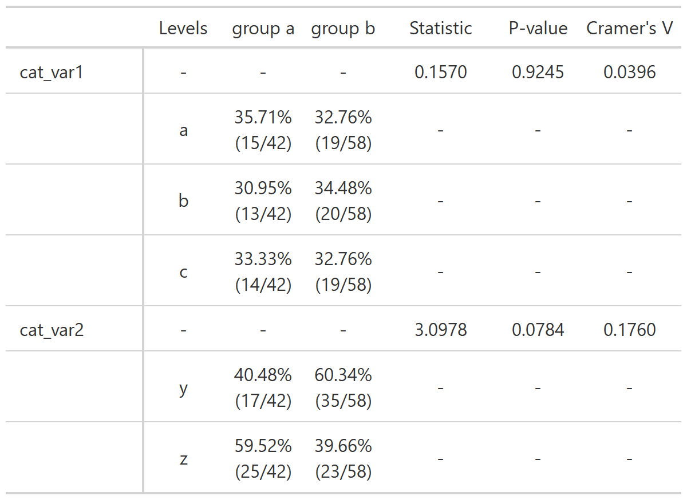
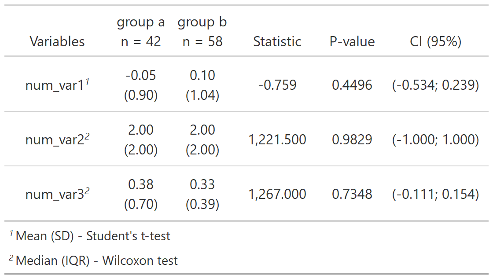

```{r, include = FALSE}
knitr::opts_chunk$set(
  collapse = TRUE,
  comment = "#>"
)
```

```{r setup, warning = FALSE, message = FALSE}
library(relper)
library(dplyr)
```

`stat_` functions apply statistical methods and show the results in an `gt` table.

# stat_two_cat

The goal of `stat_two_cat` is to create a frequency table with chi-square statistic, p-value and Cramer's V.

```{r stat_two_cat,eval = FALSE}
mtcars %>%
  mutate(vs = paste0("vs = ",vs)) %>%
  stat_two_cat(grp_var = vs,vars = c(am,cyl))
```




```{r stat_two_cat-plot, echo = FALSE}

# temp_table <- 
#   mtcars %>%
#   mutate(vs = paste0("vs = ",vs)) %>%
#   stat_two_cat(grp_var = vs,vars = c(am,cyl))
# 
# gt::gtsave(
#   temp_table,
#   "stat_two_cat.png",
#   vwidth = 1500,
#   vheight = 1000)

```

# stat_two_num

The goal of `stat_two_num` is to create a summary table comparing one or more numerical variables between two groups.

```{r stat_two_num,eval = FALSE}

stat_two_num(
  df = df,
  grp_var = grp_var,
  num_vars = c(num_var1,num_var2,num_var3)
)

```




```{r stat_two_num-plot, echo = FALSE}
# set.seed(123);df <-
#   data.frame(
#     grp_var = sample(paste("group", letters[1:2]),size = 100,replace = TRUE),
#     num_var1 = rnorm(100),
#     num_var2 = rpois(100,2),
#     num_var3 = rexp(100,2),
#    num_var4 = abs(rnorm(100))
#   )
# 
# table <- 
# stat_two_num(
#   df = df,
#   grp_var = grp_var,
#   num_vars = c(num_var1,num_var2,num_var3),
#   method = c("auto")
# )
# 
# gt::gtsave(table, "stat_two_num.png", vwidth = 1500, vheight = 1000)

```


