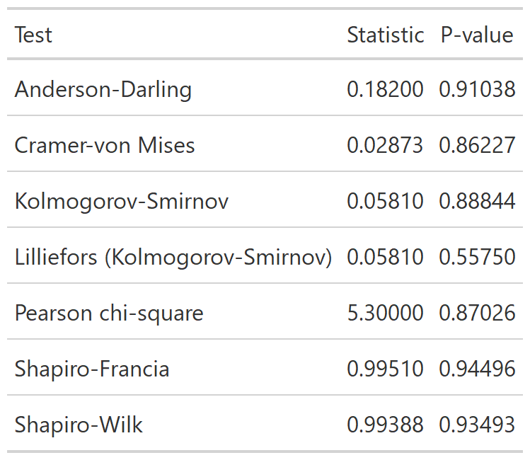

```{r, include = FALSE}
knitr::opts_chunk$set(
  collapse = TRUE,
  comment = "#>"
)
```

```{r setup, warning = FALSE, message = FALSE}
library(relper)
library(dplyr)
```

`stat_` functions apply statistical methods and show the results in an `gt` table, let's create a example data.frame to apply them.

```{r}
set.seed(1234);df <-
  data.frame(
    grp_var = sample(paste("group", letters[1:2]),size = 100,replace = TRUE),
    cat_var1 = sample(letters[1:3],size = 100,replace = TRUE),
    cat_var2 = sample(letters[25:26],size = 100,replace = TRUE),
    num_var1 = rnorm(100),
    num_var2 = rpois(100,2),
    num_var3 = rexp(100,2)
  )
```

# stat_normality

The goal of `stat_normality` is to test the normality of the data.

```{r stat_normality}
set.seed(123);x <- rnorm(100)

stat_normality(x,digits = 5)
```
You can also print as a `gt` table, by setting the argument `print` to `TRUE`.

```{r stat_normality-save, echo = FALSE,fig.height=4}

# gt::gtsave(
#   data = stat_normality(x = x,print = TRUE,digits = 5),
#   filename = "stat_normality.png",
#   path = file.path(getwd(),"figs"),
#   vwidth = 1500,
#   vheight = 1000
#   )

```


{ height=10% }


# stat_two_cat

The goal of `stat_two_cat` is to create a frequency table with chi-square statistic, p-value and Cramer's V.

```{r stat_two_cat,eval = FALSE}
df %>% 
  stat_two_cat(
    df = .,
    grp_var = grp_var,
    vars = c(cat_var1,cat_var2)
  )
```


```{r stat_two_cat-plot, echo = FALSE}

# temp_table <-
#   df %>%
#   stat_two_cat(
#     df = .,
#     grp_var = grp_var,
#     vars = c(cat_var1,cat_var2)
#   )
# 
# gt::gtsave(
#   data = temp_table,
#   filename = "stat_two_cat.png",
#   path = file.path(getwd(),"figs"),
#   vwidth = 1500,
#   vheight = 1000
#   )

```

# stat_two_num

The goal of `stat_two_num` is to create a summary table comparing one or more numerical variables between two groups.


```{r stat_two_num-plot, echo = FALSE}

# temp_table <-
#   df %>%
#   stat_two_num(
#     df = .,
#     grp_var = grp_var,
#     num_vars = c(num_var1,num_var2,num_var3)
#   )
# 
# gt::gtsave(
#   data = temp_table,
#   filename = "stat_two_num.png",
#   path = file.path(getwd(),"figs"),
#   vwidth = 1500,
#   vheight = 1000
#   )

```

```{r stat_two_num,eval = FALSE}
df %>% 
  stat_two_num(
    df = .,
    grp_var = grp_var,
    num_vars = c(num_var1,num_var2,num_var3)
  )
```


